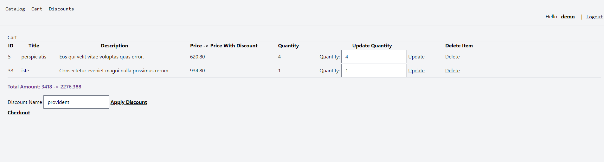
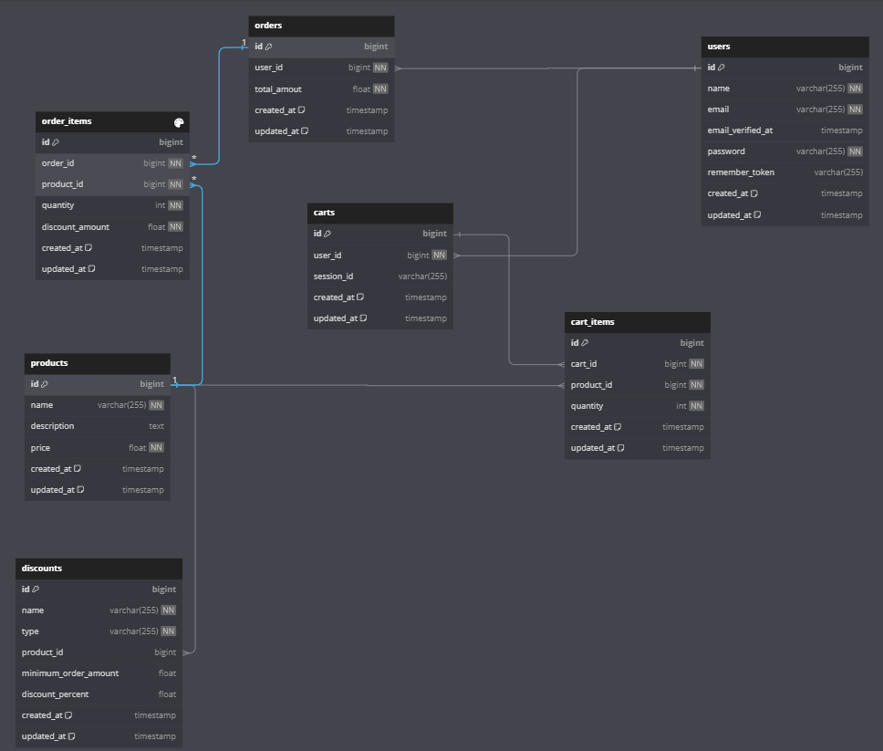
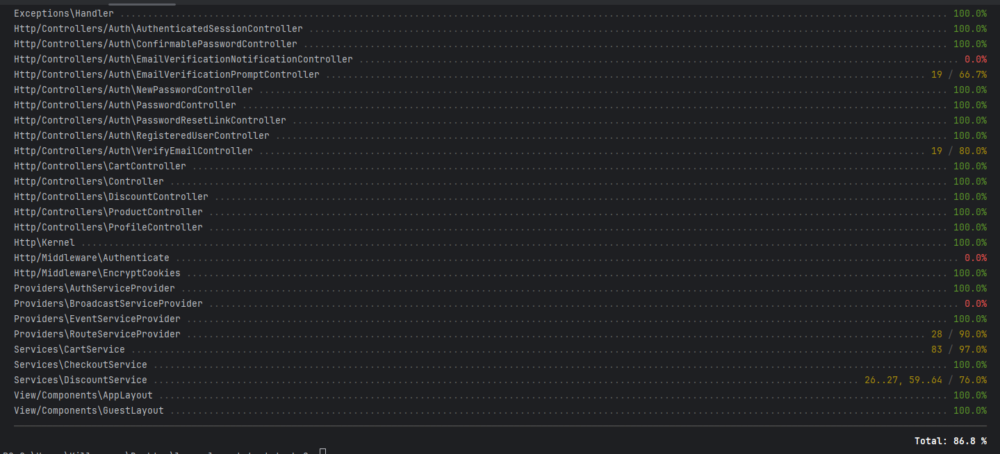

# laravel-cart-test-task

### Preview:


### Задание: [task.txt](task.txt)

``
Stack: Laravel, Blade, Tailwind sqltie(local env), mysql(prod env)
``

### Database Schema



### Test Coverage



## Инструкция По Запуску:

```
1. cp .env.example .env
```

```
2. composer install 
```

```
3. npm install 
```

```
4. vite build
```

```
5. php artisan migrate --seed
```

```
6. php artisan serve
```

#### Сервер доступен на 8000 порту

